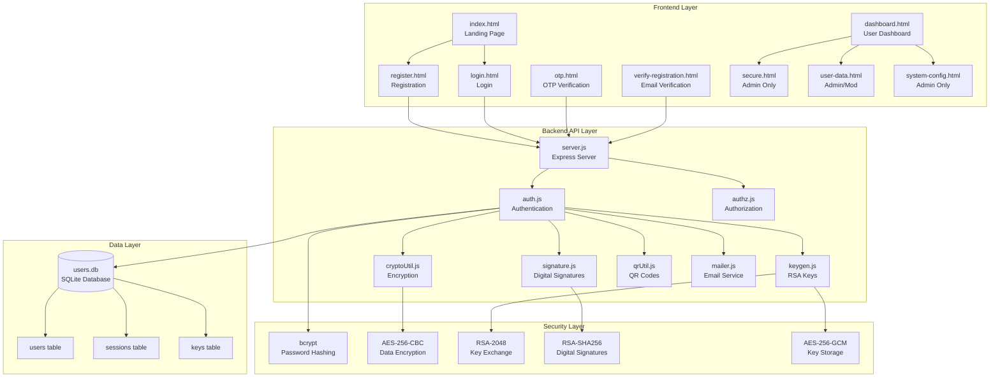
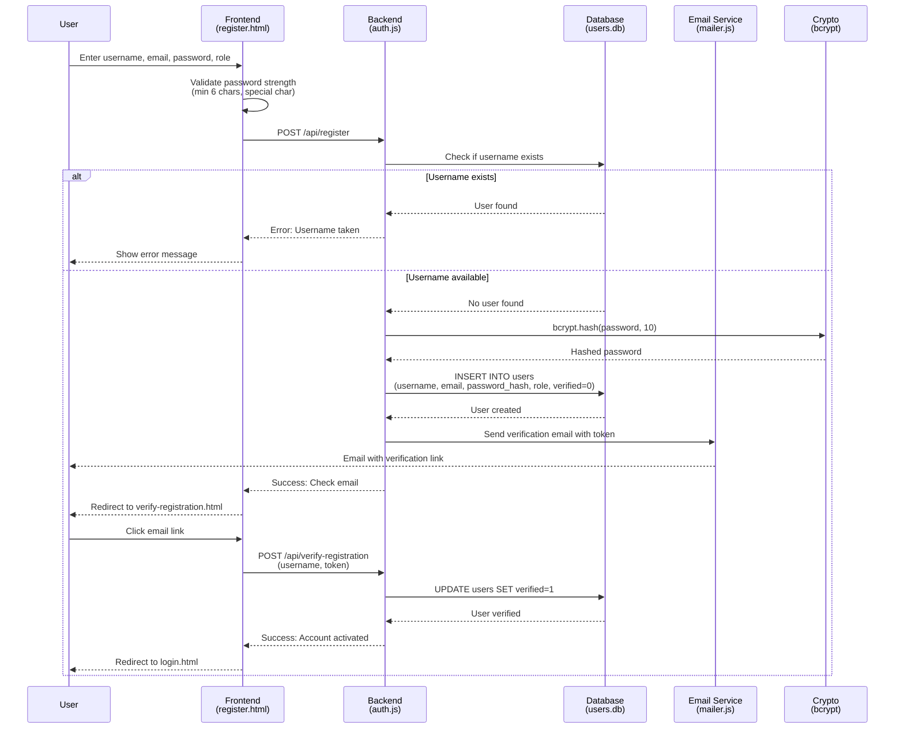
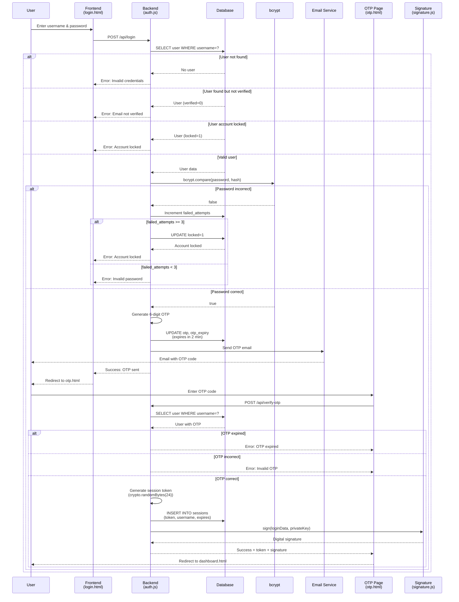
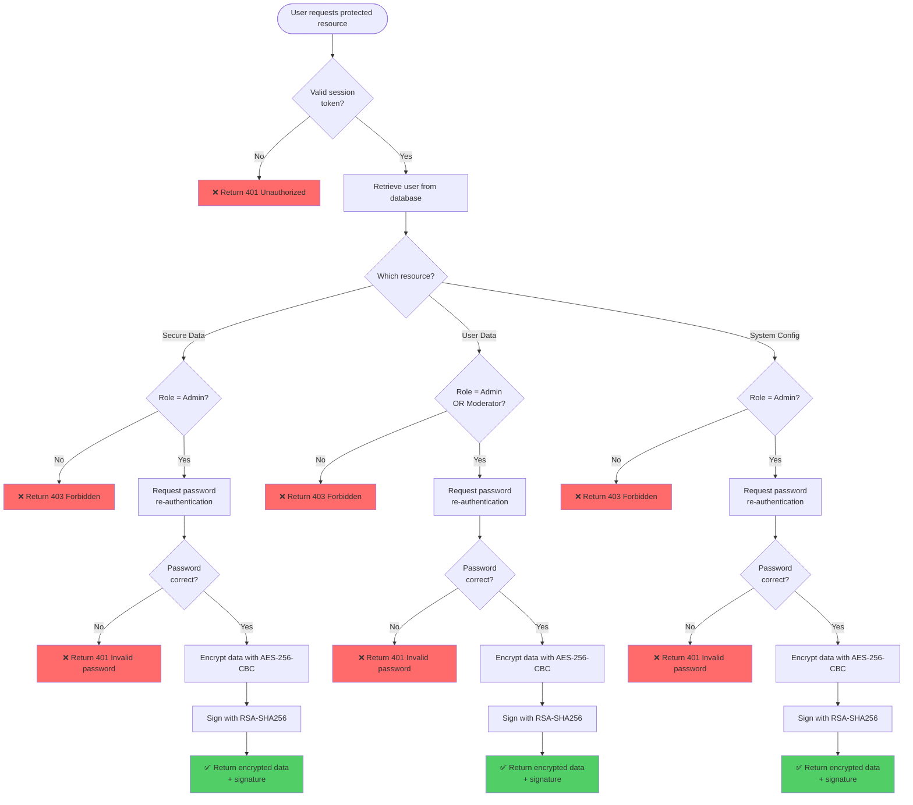
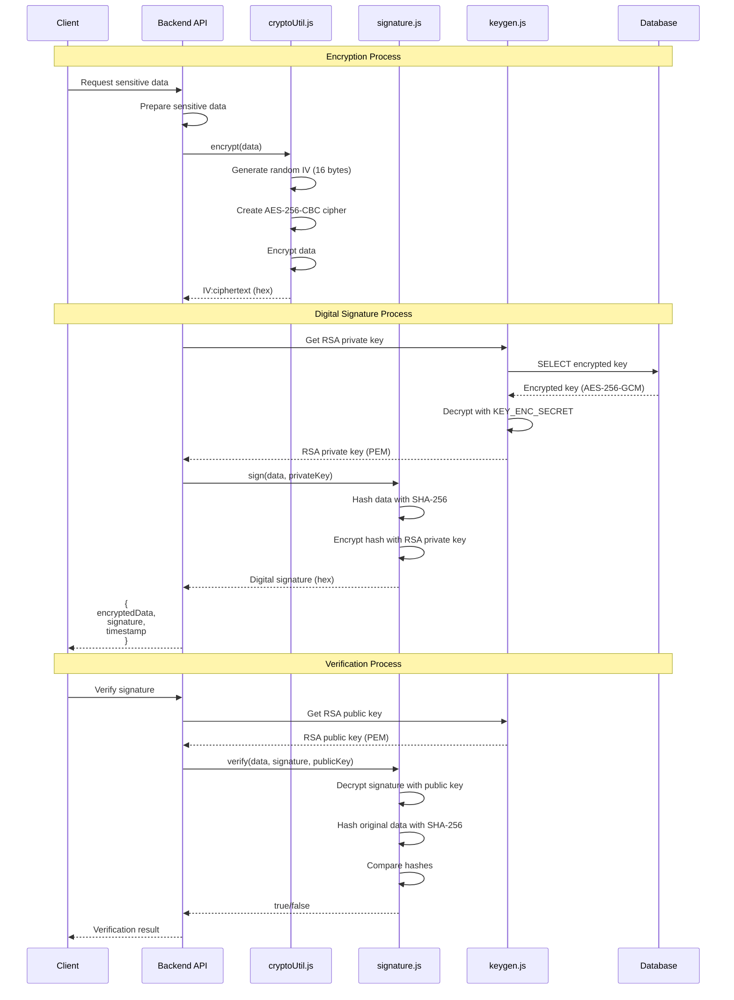
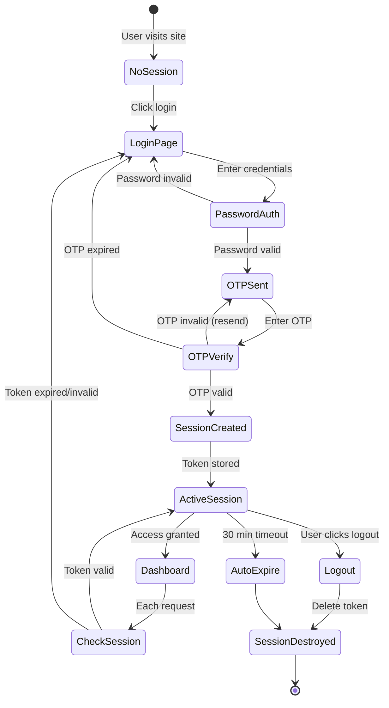

# Secure Login System - Complete Implementation

A comprehensive secure authentication and authorization system implementing multiple security layers including multi-factor authentication, encryption, digital signatures, and role-based access control.

## 🎯 Features

### Authentication
- ✅ **Single-Factor Authentication**: Username + Password
- ✅ **Multi-Factor Authentication**: Password + Email OTP
- ✅ **Email Verification**: Required for account activation
- ✅ **Account Locking**: After 3 failed login attempts

### Authorization & Access Control
- ✅ **3 Subjects**: Admin, Moderator, User
- ✅ **3 Objects**: Secure Data, User Data, System Config
- ✅ **Role-Based Access Control (RBAC)**: Enforced on all endpoints
- ✅ **Access Control Policy**: Documented and implemented

### Encryption & Security
- ✅ **AES-256-CBC Encryption**: For sensitive data
- ✅ **RSA Key Exchange**: 2048-bit RSA key pairs
- ✅ **Digital Signatures**: RSA-SHA256 for data integrity
- ✅ **Password Hashing**: bcrypt with salt (10 rounds)

### Encoding
- ✅ **QR Code Generation**: For OTP encoding (Base64)
- ✅ **Base64 Encoding**: Used in QR code generation

## 🔄 Complete Workflow & Process Flow

### System Architecture Overview



### 1. User Registration Flow



### 2. User Login Flow (Multi-Factor Authentication)



### 3. Access Control Flow (RBAC)



### 4. Data Encryption & Signature Flow



### 5. Complete Request-Response Cycle

```mermaid
flowchart LR
    subgraph "Client Side"
        A[User Action] --> B[Frontend HTML/JS]
        B --> C[Fetch API Request]
    end
    
    subgraph "Network"
        C --> D[HTTP POST/GET]
    end
    
    subgraph "Server Side"
        D --> E[Express Router]
        E --> F{Route Handler}
        
        F -->|/api/register| G[Registration Logic]
        F -->|/api/login| H[Login Logic]
        F -->|/api/verify-otp| I[OTP Verification]
        F -->|/api/secure-access| J[Access Control]
        
        G --> K[bcrypt Hash]
        H --> L[bcrypt Compare]
        I --> M[Session Creation]
        J --> N[Role Check]
        
        K --> O[(Database)]
        L --> O
        M --> O
        N --> O
        
        O --> P[Response Preparation]
        
        P --> Q{Needs Encryption?}
        Q -->|Yes| R[AES-256-CBC Encrypt]
        Q -->|No| S[Plain Response]
        
        R --> T{Needs Signature?}
        S --> T
        T -->|Yes| U[RSA-SHA256 Sign]
        T -->|No| V[Final Response]
        U --> V
    end
    
    subgraph "Network Return"
        V --> W[HTTP Response]
    end
    
    subgraph "Client Side Return"
        W --> X[Frontend Receives]
        X --> Y{Success?}
        Y -->|Yes| Z[Update UI / Redirect]
        Y -->|No| AA[Show Error]
    end
    
    style O fill:#4dabf7
    style R fill:#51cf66
    style U fill:#ffd43b
```



### 6. Session Management Flow



### 7. Access Control Matrix Implementation

| Role | Secure Data | User Data | System Config |
|------|-------------|-----------|---------------|
| **Admin** | ✅ Full Access | ✅ Full Access | ✅ Full Access |
| **Moderator** | ❌ No Access | ✅ Read Access | ❌ No Access |
| **User** | ❌ No Access | ❌ No Access | ❌ No Access |

**Implementation**: Each protected endpoint checks:
1. Valid session token exists
2. User role matches required permission
3. Password re-authentication for sensitive operations

### 8. Cryptographic Operations Flow

```mermaid
graph TB
    subgraph "Password Operations"
        A1[User Password] --> A2[bcrypt.hash<br/>10 rounds]
        A2 --> A3[Salted Hash<br/>60 chars]
        A3 --> A4[(Store in DB)]
        
        B1[Login Attempt] --> B2[bcrypt.compare]
        A4 --> B2
        B2 --> B3{Match?}
        B3 -->|Yes| B4[Grant Access]
        B3 -->|No| B5[Deny Access]
    end
    
    subgraph "Data Encryption"
        C1[Sensitive Data] --> C2[Generate IV<br/>16 bytes]
        C2 --> C3[AES-256-CBC<br/>Encrypt]
        C3 --> C4[IV:Ciphertext]
        C4 --> C5[Send to Client]
        
        C5 --> C6[Client Decrypt Request]
        C6 --> C7[Extract IV]
        C7 --> C8[AES-256-CBC<br/>Decrypt]
        C8 --> C9[Original Data]
    end
    
    subgraph "Digital Signatures"
        D1[Data to Sign] --> D2[SHA-256 Hash]
        D2 --> D3[RSA Private Key<br/>Encrypt Hash]
        D3 --> D4[Digital Signature]
        
        D4 --> D5[Verification Request]
        D5 --> D6[RSA Public Key<br/>Decrypt Signature]
        D6 --> D7[Compare Hashes]
        D7 --> D8{Valid?}
        D8 -->|Yes| D9[Data Authentic]
        D8 -->|No| D10[Data Tampered]
    end
    
    subgraph "Key Management"
        E1[Server Startup] --> E2{Keys Exist?}
        E2 -->|No| E3[Generate RSA-2048<br/>Key Pair]
        E3 --> E4[Encrypt with<br/>AES-256-GCM]
        E4 --> E5[(Store in DB)]
        E2 -->|Yes| E6[Load from DB]
        E6 --> E7[Decrypt with<br/>AES-256-GCM]
        E7 --> E8[Use for Signatures]
    end
```



## 📋 Rubric Coverage

| Component | Status | Marks |
|-----------|--------|-------|
| Single-Factor Auth | ✅ Complete | 1/1 |
| Multi-Factor Auth | ✅ Complete | 1.5/1.5 |
| Access Control Model | ✅ Complete | 1.5/1.5 |
| Policy Definition | ✅ Complete | 1.5/1.5 |
| Access Control Implementation | ✅ Complete | 1.5/1.5 |
| Key Exchange | ✅ Complete | 1.5/1.5 |
| Encryption/Decryption | ✅ Complete | 1.5/1.5 |
| Hashing with Salt | ✅ Complete | 1.5/1.5 |
| Digital Signature | ✅ Complete | 1.5/1.5 |
| Encoding Techniques | ✅ Complete | 1/1 |
| Security Documentation | ✅ Complete | 1/1 |
| Attacks Documentation | ✅ Complete | 1/1 |

**Total: 15/15 marks** (excluding Viva and Class Participation)

## 🚀 Getting Started

### Prerequisites
- Node.js (v14 or higher)
- npm or yarn
- Gmail account (for email OTP - optional, OTPs shown in console if not configured)

### Installation

1. **Install Backend Dependencies**
```bash
cd backend
npm install
```

2. **Configure Email (Optional)**
Edit `backend/mailer.js` and update:
- `EMAIL_USER`: Your Gmail address
- `EMAIL_PASS`: Your Gmail App Password

Or set environment variables:
```bash
export EMAIL_USER=your-email@gmail.com
export EMAIL_PASS=your-app-password
```

3. **Start the Server**
```bash
node server.js
```

The server will run on `http://localhost:3000`

4. **Open Frontend**
Open `frontend/index.html` in your browser or use a local server:
```bash
cd frontend
python -m http.server 8000
```

Then visit `http://localhost:8000`

## 📁 Project Structure

```
secure-login-system/
├── backend/
│   ├── auth.js              # Authentication & Authorization endpoints
│   ├── authz.js             # Authorization middleware
│   ├── cryptoUtil.js        # AES encryption/decryption
│   ├── signature.js         # Digital signature functions
│   ├── keygen.js            # RSA key generation
│   ├── qrUtil.js            # QR code generation
│   ├── mailer.js            # Email OTP sending
│   ├── db.js                # Database setup
│   ├── server.js            # Express server
│   └── users.db             # SQLite database
├── frontend/
│   ├── index.html           # Landing page
│   ├── register.html        # Registration
│   ├── login.html           # Login
│   ├── otp.html             # OTP verification
│   ├── verify-registration.html  # Email verification
│   ├── dashboard.html       # User dashboard
│   ├── secure.html          # Secure data access (Admin)
│   ├── user-data.html       # User data access (Admin/Mod)
│   ├── system-config.html   # System config (Admin)
│   ├── admin.html           # Admin panel
│   └── style.css            # Styling
├── ACCESS_CONTROL_POLICY.md # Access control documentation
├── SECURITY_DOCUMENTATION.md # Security risks & attacks
└── README.md                # This file
```

## 🔐 API Endpoints

### Authentication
- `POST /api/register` - Register new user
- `POST /api/login` - Login (sends OTP)
- `POST /api/verify-otp` - Verify OTP for login
- `POST /api/verify-registration` - Verify email for registration

### Access Control (3 Objects)
- `POST /api/secure-access` - Secure data (Admin only)
- `POST /api/user-data` - User data (Admin + Moderator)
- `POST /api/system-config` - System config (Admin only)

### Security Features
- `POST /api/decrypt-data` - Decrypt encrypted data
- `POST /api/verify-signature` - Verify digital signature
- `GET /api/qr-code/:username` - Get QR code for OTP

## 👥 User Roles

### Admin
- Full system access
- Can access: Secure Data, User Data, System Config
- Can manage all users

### Moderator
- User management access
- Can access: User Data only
- Cannot access: Secure Data, System Config

### User
- Basic authenticated access
- Can access: Own profile only
- Cannot access: Any administrative functions

## 🔒 Security Features

### Password Security
- bcrypt hashing with salt (10 rounds)
- Minimum 6 characters
- Requires special character
- Account locking after 3 failed attempts

### Multi-Factor Authentication
- Password (something you know)
- Email OTP (something you receive)
- OTP expires in 2 minutes
- Single-use OTPs

### Data Protection
- AES-256-CBC encryption for sensitive data
- RSA-SHA256 digital signatures for integrity
- Encrypted data storage in database
- Secure key management

### Access Control
- Role-based access control (RBAC)
- Server-side authorization checks
- Access control matrix implementation
- Policy-based access decisions

## 📚 Documentation

- **ACCESS_CONTROL_POLICY.md**: Complete access control policy with matrix
- **SECURITY_DOCUMENTATION.md**: Security levels, risks, attacks, and countermeasures
- **RUBRIC_COVERAGE_ANALYSIS.md**: Detailed rubric coverage analysis

## 🧪 Testing

### Test Users
Create users with different roles:
1. Admin user
2. Moderator user
3. Regular user

### Test Scenarios
1. Register → Verify Email → Login → Access Resources
2. Test access control for each role
3. Test encryption/decryption
4. Test digital signature verification
5. Test QR code generation

## ⚠️ Important Notes

- **Email Configuration**: If not configured, OTPs are displayed in console
- **Database**: SQLite database is created automatically
- **Keys**: RSA keys are generated automatically on first run
- **RSA keys are encrypted-at-rest**: set `KEY_ENC_SECRET` before first run so RSA keys can be encrypted and later decrypted
- **Production**: This is a demonstration system. For production:
  - Use HTTPS
  - Implement rate limiting
  - Add comprehensive logging
  - Use secure key management
  - Regular security audits

## 📝 License

This project is for educational purposes.

## 👨‍💻 Author

Secure Login System - Complete Implementation

---

**Status**: ✅ All rubric requirements implemented and documented

## 🔐 RSA key encryption in `users.db` (view encrypted values)

RSA PEM keys are stored in SQLite table `keys` as an **encrypted JSON blob** (AES-256-GCM).

### Set the encryption secret (required)

PowerShell (Windows):

```powershell
$env:KEY_ENC_SECRET="replace-with-a-strong-secret"
cd backend
node server.js
```

Or (Windows-friendly) create `backend/config.local.json` from the example:

- Copy `backend/config.local.json.example` → `backend/config.local.json`
- Edit `KEY_ENC_SECRET`

Then run `node server.js` (no env var needed).

### If you already generated plaintext keys earlier

Delete the old rows so new encrypted keys can be generated:

```sql
DELETE FROM keys;
```

Restart `node server.js`.

### Print what’s stored in `users.db`

Run:

```bash
cd backend
node print-keys.js
```

This prints `keys.key_value` previews (you’ll see Base64 `iv`, `tag`, and ciphertext `ct`, not PEM).
